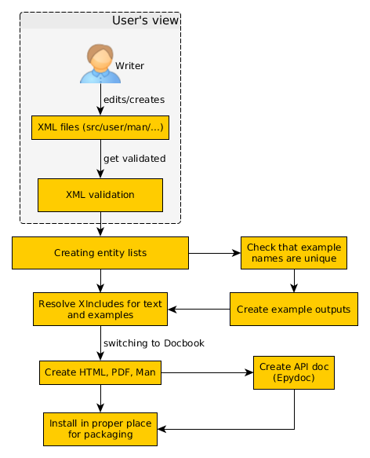
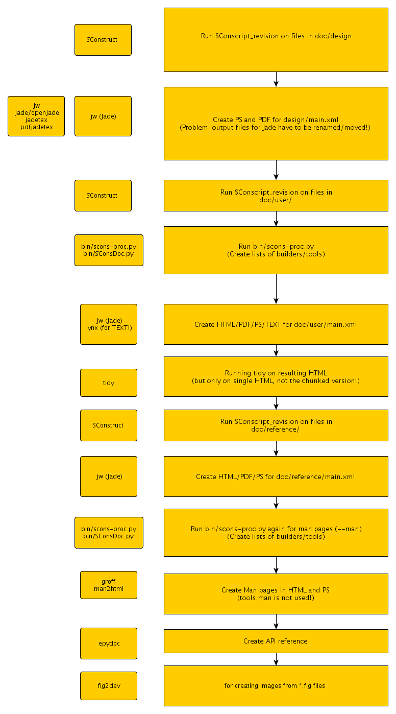

**Table of Contents**

[TOC]

# Updating documentation

This article describes the SCons documentation toolchain in versions 2.3.x and higher. It's based on the file `doc/overview.rst` in the source repository, so go there first to add or change text please. 

## Introduction

This article gives an overview of the SCons documentation toolchain. Interested users should better understand where and how the text he writes is processed. It also provides a reference for core developers and the release team.

The diagram above describes steps that required for creating all the MAN pages, User manuals and reference documents. You may be wondering, "Why doesn't SCons simply convert XML files to PDF with Docbook or use REST?" Please continue reading, and things will become clearer. 

Our toolchain not only produces beautiful HTML and PDF files, but it also performs a lot of processing under the covers. We aim for consistent documentation; thus, extra steps are required.

## Writer's view

The toolchain only allows the User a restricted view on this whole "document processing cycle"; therefore, the User should only be concerned about updating or adding to documentation text. Even when adding a completely new chapter, the User can simply fire up an XML editor of choice and type away. A few configurations for XML editors [supporting WYSIWYG editing](/DeveloperGuide/WysiwygDocumentation) are provided. 

Really nice Users also care about validating XML files against our special "SCons Docbook DTD/XSD".  This can be acheived via an XML editor or executing the SCons document validation script: `python bin/docs-validate.py`
from the top source folder afterwards or, preferably, both. 

Once all all validation passes, all that's left is a pull request on Bitbucket. That's it! 

Additionally, single documents can be created to get a feel for how the final result looks. Each of the document folders, `design`, `developer`, `man`, `python10`, `reference`, and `user`, contains an `SConstruct` file along with the actual XML files. By calling `python ../../src/script/scons.py` from within the directory, the User can have the MAN pages, HTML, and even PDF generated if you have a renderer installed: `fop`, `xep` or `jw`. 

If you haven't already downloaded the documentation sources to your computer, please visit [Introduction](Introduction) now. It will give you pointers, and lead you through the steps of setting up a local repository. Then, you can find the documentation stuff in the folder `doc` at the top-level. 

## Requirements

Install python bindings for `libxml2` (libxml2-python) with `libxslt` (libxslt-python). (Deprecated) `lxml` (python-lxml) may also be used. For rendering PDF documents, you'll `fop`, `xep` or `jw` available in your system-wide `$PATH`. Creating the EPUB output files of the [UserGuide](UserGuide) and the MAN page depend on the Ghostscript executable `gs` for creating the front cover image.  `fop` requires Java but is easily installed via `apt-get` on Debian/Ubuntu. `jw` is available for Debian/Ubuntu as part of the `docbook-utils` package.  You'll also need `epydoc` in the `python-epydoc` package.

## Validation

We are using our own DTD/XSD as a kind of hook, which only exists to link our own SCons documentation tags into the normal Docbook XSD. For the output, we always have an intermediary step (see diagram above), where we rewrite tags like `cvar` into a block of Docbook formatting elements representing it. 

The toolchain, and all the Python scripts supporting it, are based on the prerequisite that all documents are valid against the SCons Docbook XSD. This step guarantees that we can accept the pull request of a user/writer and create documentation for a new release of SCons without any problems later. 

## Entities

We are using entities for special keywords like `SCons` that should appear with the same formatting throughout the text. Entities are kept in a single file `doc/scons.mod` which gets included by the documents. 

Additionally, for each `Tool`, `Builder`, `Cvar` and `Function`, a bunch of linkends in the form of entities get defined which can be used in the MAN page and the User manual. 

When you add an XML file in the `src/engine/Tools` folder (EG. a tool named `foobar`), you can use the following two entities:

t-foobar
: which prints the name of the Tool, and 

t-link-foobar
: which is a link to the description of the Tool in the Appendix 

within the User guide's text. 

By calling the script `python bin/docs-update-generated.py`, you can recreate the lists of entities (`*.mod`) in the `generated` folder. This will also generate the `*.gen` files, which list the full description of all the `Builders`, `Tools`, `Functions` and `CVars` for the MAN page and User Guide appendix. 

For more information about describing these elements, refer to the start of the Python script `bin/SConsDoc.py`. The file describes the available tags and the exact syntax in detail. 

## Examples

In the User Guide, we support automatically created examples. This means that the output of the specified source files and SConstructs is generated by running them with the current SCons version. We do this to ensure that the output displayed in the manual, is identical to what you get when you run the example on the command-line. 

A short description about how these examples have to be defined, can be found at the start of the file `bin/SConsExamples.py`. Call `python bin/docs-create-example-outputs.py` from the top level source folder, to run all examples through SCons.

Before this script starts to generate any output, it checks whether the names of all defined examples are unique. Another important prerequisite is that all the single `scons_output` blocks need to have a `suffix` attribute defined. These suffixes also have to be unique, within each example. 

All example output files (`*.xml`) get written to the folder `doc/generated/examples` together with all files defined via the `scons_example_file` tag which are version controlled.  This makes comparing the output of newly generated examples easy for a new version of SCons. 

Note that these output files are not actually needed for editing the documents. When loading the User manual into an XML editor, you will always see the example's definition. Only when you create some output will the files from `doc/generated/examples` get XIncluded and all special `scons*` tags transformed into Docbook elements. 

## Directories

Documents are in the folders `design`, `developer`, `man`, `python10`, `reference`, and `user`.

editor_configs
: Prepared [configuration sets for the validating WYSIWYG XML editors XmlMind and Serna](/DeveloperGuide/WysiwygDocumentation). Try the latter because the XXE config requires you to have a full version (costing a few hundred bucks) and is therefore untested. For installing the Serna config, simply copy the `scons` folder into the `plugins` directory of your installation. Likewise, the XXE files from the `xmlmind` folder have to be copied into `~/.xxe4/` under Linux. 

generated
: Entity lists and outputs of the [UserGuide](UserGuide) examples. They get generated by the update scripts `bin/docs-update-generated.py` and `bin/docs-create-example-outputs.py`. 

images
: Images for the `overview.rst` document. 

xsd
: The SCons Docbook schema (XSD), based on the Docbook v4.5 DTD/XSD. 

xslt
: XSLT transformation scripts for converting the special SCons tags like `scons_output` to valid Docbook during document processing. 

# Old toolchain

**This is the documentation for SCons versions before 2.3.x; see also the [discussion page](DeveloperGuide/Documentation/Discussion) for some points that got discussed and finally led to the new [DocBook](DocBook)-based approach above.** 

Documentation sources for Docbook are maintained in `doc/*/*.xml` files. For the ones that require preprocessing to insert examples, the primary source files are `doc/*/*.in`.  We have our own preprocessing stage to update and insert examples into XML sources before they are processed. 

## List of tools you'll need to build documentation

These package names can be passed directly to 'apt-get install' for Ubuntu or Debian. 

* python-epydoc 
* jade 
* openjade 
* tetex-bin 
* tetex-latex 
* texlive-latex-extra 
* jadetex ? 
* docbook 
* docbook-doc 
* docbook-dsssl 
* docbook-to-man 
* docbook-utils 
* docbook-xml 
* docbook-xsl 
* docbook2x 
* man2html 

[[GaryOberbrunner](GaryOberbrunner) 15-Jul-12] As of Ubuntu 10.04, some of the above pkgs don't exist.  These do: `apt-get install python-epydoc jade openjade texinfo texlive-latex-extra jadetex docbook docbook-dsssl docbook-to-man docbook-utils docbook-xml docbook-xsl docbook2x man2html` and the doc seems to build OK with those packages (and their dependencies). 

Not strictly doc-related, but if you're doing release builds, you also need rpm if you're on a non-RedHat/CentOS machine: `apt-get install rpm`.

## Steps to update or add content to the User Guide

1. Edit the doc/user/file.in 
1. python bin/scons-doc.py --diff file 
1. Review the diffs introduced by your changes, and proceed if they look correct 
1. python bin/scons-doc.py --update file 
1. python bootstrap.py doc 
1. Review the generated documents in build/doc/html/scons-user.html (and .ps and .pdf) 
1. Submit patch for review 

## Future work

1. Make documentation building process cross-platform 
1. Cut the amount of tools and dependencies (preferably to Python modules) 

## Behind the curtain

The following image depicts the single steps of a full build for the documentation. The first (and zeroth) column shows the required tools (= dependencies) for each section (= second column). 

 
