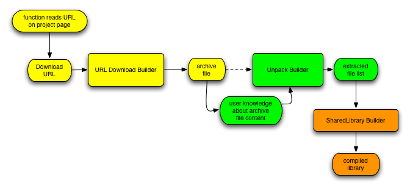

# Download- & Unpack-Builder

The idea for these builders is created by the requirement that a project uses different libraries and some libraries must be installed with different compiler- and linker options. The libraries must be also updated during the project lifetime. The task of the builders should be: 

1. download the source code of a library (eg tar.gz / tar.bz2) 
1. unpack this file 
1. build the source code with SCons to a shared / static library 
1. install the header files and library





The picture shows the build process of a shared library, so the latest version of a library should be read from the project webpage, the download URL should be pushed to the builder, that gets the file, this file is pushed to a builder, which extracts the file and pushs the file content, which is needed by the shared library builder, to SCons [SharedLibrary](SharedLibrary) call, which is build finally the library. The update process is worked in an equal way, because only the URL changes.  


## Download Builder

The Download-Builder should only download a file from a URL input. Python supports the [`urllib` package](https://docs.python.org/3/library/urllib.html). The filename of the downloaded file can be created by the users target name or should be created by the server, that sends the file. This information can be handle by Python's [`urllib.parse` module](https://docs.python.org/3/library/urllib.parse.html#module-urllib.parse).


```python
import urllib.request, urllib.error, urllib.parse
import SCons.Builder, SCons.Node, SCons.Errors


# define an own node, for checking the data behind the URL,
# we must download only than, if the data is changed, the
# node derivates from the Python.Value node
class URLNode(SCons.Node.Python.Value):

    # overload the get_csig (copy the source from the
    # Python.Value node and append the data of the URL header
    def get_csig(self, calc=None):
        try:
            return self.ninfo.csig
        except AttributeError:
            pass

        # read URL header information
        try:
            response = urllib.request.urlopen(str(self.value)).info()
        except Exception as e:
            raise SCons.Errors.StopError(e)

        contents = ""
        # append the data from the URL header if exists
        # otherwise the returning data is equal to the Python.Value node
        if "Last-Modified" in response:
            contents = contents + response["Last-Modified"]
        if "Content-Length" in response:
            contents = contents + response["Content-Length"]
        if not contents:
            contents = self.get_contents()
        self.get_ninfo().csig = contents
        return contents


# creates the downloading output message
# @param s original message
# @param target target name
# @param source source name
# @param env environment object
def __message(s, target, source, env):
    print("downloading [%s] to [%s] ..." % (source[0], target[0]))


# the download function, which reads the data from the URL
# and writes it down to the file
# @param target target file on the local drive
# @param source URL
# @param env environment object
def __action(target, source, env):
    try:
        stream = urllib.request.urlopen(str(source[0]))
        file = open(str(target[0]), "wb")
        file.write(stream.read())
        file.close()
        stream.close()
    except Exception as e:
        raise SCons.Errors.StopError(e)


# defines the emitter of the builder
# @param target target file on the local drive
# @param source URL
# @param env environment object
def __emitter(target, source, env):
    # we need a temporary file, because the dependency graph
    # of Scons need a physical existing file - so we prepare it
    target[0].prepare()

    if not env.get("URLDOWNLOAD_USEURLFILENAME", False):
        return target, source

    try:
        url = urllib.parse.urlparse(str(source[0]))
    except Exception as e:
        raise SCons.Errors.StopError(e)

    return url.path.split("/")[-1], source


# generate function, that adds the builder to the environment,
# the value "DOWNLOAD_USEFILENAME" replaces the target name with
# the filename of the URL
# @param env environment object
def generate(env):
    env["BUILDERS"]["URLDownload"] = SCons.Builder.Builder(
        action=__action,
        emitter=__emitter,
        target_factory=SCons.Node.FS.File,
        source_factory=URLNode,
        single_source=True,
        PRINT_CMD_LINE_FUNC=__message,
    )
    env.Replace(URLDOWNLOAD_USEURLFILENAME=True)


# existing function of the builder
# @param env environment object
# @return true
def exists(env):
    return 1
```
The `__action` is the builder function, that downloads the file. The function uses the urllib object and writes the data to a file stream with the target name. The emitter function `__emitter` defines the emitter function, so this function translates the URL filename into the target filename. Within the builder this option can be enabled / disabled by setting the flag `URLDOWNLOAD_USEURLFILENAME` with a boolean value. The URLParse extension can read the file information and returns it. The emitter is run before the builder creates the file (downloads the data to a file), so the emitter must be "prepare" the target first. 

The `generate` function initializes the builder, so the emitter and action function are set. The `single_source` option is set to true, because the builder creates only one file. Important options are the `target_factory` and the `source_factory`, because this builder should create a file, so the `target_factory` must be set to a file, but the `source_factory` gets an URL input, so a normal string (Python) value must be used. The target should be build only if the data behind the source is changed, an URL is a static value, so we need a check on the server. In this case we need to define our own node (`URLNode`). This node derivate all data from the `SCons.Node.Python.Value`, be we need to overload the `get_csig`, because with this method SCons creates the information if a target is up-to-date. I have copied the content from the `SCons.Node.Python.Value` and append only the URL header information. 

The builder can be used with (the URL can be any URL type which is supported by Pythons urllib) 


```python
#!python 
env.URLDownload( "<filename>", "<download url>" )
```

## Unpack Builder

The next step is an Unpack-Builder, that can unpack a tar.gz or tar.bz2 file. Unix derivatives uses GZip, BZip2 and Tar for extracting these filetypes, which are often part of the distribution. On MS Windows [7-Zip](https://www.7-zip.org/) can handle these files, so the builder uses depend on the system the correct toolset. Each tool can return another format of the archive file & directory list, so the builder must understand the format for create the correct target list, in this case the builder supports a callable Python structure that splits the text output of the tool into a target file list. Because of this circumstances the call of the extracting tool must catch the output. The emitter of the builder should create a file list with individual split of the output and the builder should run the extract command. 


```python
#!python 
import subprocess, os
import SCons.Errors, SCons.Warnings, SCons.Util


# enables Scons warning for this builder
class UnpackWarning(SCons.Warnings.Warning) :
    pass

SCons.Warnings.enableWarningClass(UnpackWarning)


# extractor function for Tar output
# @param env environment object
# @param count number of returning lines
# @param no number of the output line
# @param i line content
def __fileextractor_nix_tar( env, count, no, i ) :
    return i.split()[-1]

# extractor function for GZip output,
# ignore the first line
# @param env environment object
# @param count number of returning lines
# @param no number of the output line
# @param i line content
def __fileextractor_nix_gzip( env, count, no, i ) :
    if no == 0 :
        return None
    return i.split()[-1]

# extractor function for Unzip output,
# ignore the first & last two lines
# @param env environment object
# @param count number of returning lines
# @param no number of the output line
# @param i line content
def __fileextractor_nix_unzip( env, count, no, i ) :
    if no < 3 or no >= count - 2 :
        return None
    return i.split()[-1]

# extractor function for 7-Zip
# @param env environment object
# @param count number of returning lines
# @param no number of the output line
# @param i line content
def __fileextractor_win_7zip( env, count, no, i ) :
    item = i.split()
    if no > 8 and no < count - 2 :
        return item[-1]
    return None


# returns the extractor item for handling the source file
# @param source input source file
# @param env environment object
# @return extractor entry or None on non existing
def __getExtractor( source, env ) :
    # we check each unpacker and get the correct list command first, run the command and
    # replace the target filelist with the list values, we sorte the extractors by their priority
    for unpackername, extractor in sorted(env["UNPACK"]["EXTRACTOR"].iteritems(), key = lambda (k,v) : (v["PRIORITY"],k)):

        if not SCons.Util.is_String(extractor["RUN"]) :
            raise SCons.Errors.StopError("list command of the unpack builder for [%s] archives is not a string" % (unpackername))
        if not len(extractor["RUN"]) :
            raise SCons.Errors.StopError("run command of the unpack builder for [%s] archives is not set - can not extract files" % (unpackername))


        if not SCons.Util.is_String(extractor["LISTFLAGS"]) :
            raise SCons.Errors.StopError("list flags of the unpack builder for [%s] archives is not a string" % (unpackername))
        if not SCons.Util.is_String(extractor["LISTCMD"]) :
            raise SCons.Errors.StopError("list command of the unpack builder for [%s] archives is not a string" % (unpackername))

        if not SCons.Util.is_String(extractor["EXTRACTFLAGS"]) :
            raise SCons.Errors.StopError("extract flags of the unpack builder for [%s] archives is not a string" % (unpackername))
        if not SCons.Util.is_String(extractor["EXTRACTCMD"]) :
            raise SCons.Errors.StopError("extract command of the unpack builder for [%s] archives is not a string" % (unpackername))


        # check the source file suffix and if the first is found, run the list command
        if not SCons.Util.is_List(extractor["SUFFIX"]) :
            raise SCons.Errors.StopError("suffix list of the unpack builder for [%s] archives is not a list" % (unpackername))

        for suffix in extractor["SUFFIX"] :
            if str(source[0]).lower()[-len(suffix):] == suffix.lower() :
                return extractor

    return None


# creates the extracter output message
# @param s original message
# @param target target name
# @param source source name
# @param env environment object
def __message( s, target, source, env ) :
    print "extract [%s] ..." % (source[0])


# action function for extracting of the data
# @param target target packed file
# @param source extracted files
# @param env environment object
def __action( target, source, env ) :
    extractor = __getExtractor(source, env)
    if not extractor :
        raise SCons.Errors.StopError( "can not find any extractor value for the source file [%s]" % (source[0]) )


    # if the extract command is empty, we create an error
    if len(extractor["EXTRACTCMD"]) == 0 :
        raise SCons.Errors.StopError( "the extractor command for the source file [%s] is empty" % (source[0]) )

    # build it now (we need the shell, because some programs need it)
    handle = None
    cmd    = env.subst(extractor["EXTRACTCMD"], source=source, target=target)

    if env["UNPACK"]["VIWEXTRACTOUTPUT"] :
        handle  = subprocess.Popen( cmd, shell=True )
    else :
        devnull = open(os.devnull, "wb")
        handle  = subprocess.Popen( cmd, shell=True, stdout=devnull )

    if handle.wait() <> 0 :
        raise SCons.Errors.BuildError( "error running extractor [%s] on the source [%s]" % (cmd, source[0])  )


# emitter function for getting the files
# within the archive
# @param target target packed file
# @param source extracted files
# @param env environment object
def __emitter( target, source, env ) :
    extractor = __getExtractor(source, env)
    if not extractor :
        raise SCons.Errors.StopError( "can not find any extractor value for the source file [%s]" % (source[0]) )

    # we do a little trick, because in some cases we do not have got a physical
    # file (eg we download a packed archive), so we don't get a list or knows
    # the targets. On physical files we can do this with the LISTCMD, but on
    # non-physical files we hope the user knows the target files, so we inject
    # this knowledge into the return target.
    if env.has_key("UNPACKLIST") :
        if not SCons.Util.is_List(env["UNPACKLIST"]) and not SCons.Util.is_String(env["UNPACKLIST"]) :
            raise SCons.Errors.StopError( "manual target list of [%s] must be a string or list" % (source[0]) )
        if not env["UNPACKLIST"] :
            raise SCons.Errors.StopError( "manual target list of [%s] need not be empty" % (source[0]) )
        return env["UNPACKLIST"], source


    # we check if the source file exists, because we would like to read the data
    if not source[0].exists() :
        raise SCons.Errors.StopError( "source file [%s] must be exist" % (source[0]) )

    # create the list command and run it in a subprocess and pipes the output to a variable,
    # we need the shell for reading data from the stdout
    cmd    = env.subst(extractor["LISTCMD"], source=source, target=target)
    handle = subprocess.Popen( cmd, shell=True, stdout=subprocess.PIPE )
    target = handle.stdout.readlines()
    handle.communicate()
    if handle.returncode <> 0 :
        raise SCons.Errors.StopError("error on running list command [%s] of the source file [%s]" % (cmd, source[0]) )

    # if the returning output exists and the listseperator is a callable structure
    # we run it for each line of the output and if the return of the callable is
    # a string we push it back to the target list
    try :
        if callable(extractor["LISTEXTRACTOR"]) :
            target = filter( lambda s : SCons.Util.is_String(s), [ extractor["LISTEXTRACTOR"]( env, len(target), no, i) for no, i in enumerate(target) ] )
    except Exception, e :
        raise SCons.Errors.StopError( "%s" % (e) )

    # the line removes duplicated names - we need this line, otherwise a cyclic dependency error will occured,
    # because the list process can create redundant data (an archive file can not store redundant content in a filepath)
    target = [i.strip() for i in list(set(target))]
    if not target :
        SCons.Warnings.warn(UnpackWarning, "emitter file list on target [%s] is empty, please check your extractor list function [%s]" % (source[0], cmd) )

    # we append the extractdir to each target if is not absolut
    if env["UNPACK"]["EXTRACTDIR"] <> "." :
        target = [i if os.path.isabs(i) else os.path.join(env["UNPACK"]["EXTRACTDIR"], i) for i in target]

    return target, source


# generate function, that adds the builder to the environment
# @param env environment object
def generate( env ) :
    # setup environment variable
    toolset = {
        "STOPONEMPTYFILE"  : True,
        "VIWEXTRACTOUTPUT" : False,
        "EXTRACTDIR"       : ".",
        "EXTRACTOR" : {
            "TARGZ" : {
                "PRIORITY"       : 0,
                "SUFFIX"         : [".tar.gz", ".tgz", ".tar.gzip"],
                "EXTRACTSUFFIX"  : "",
                "EXTRACTFLAGS"   : "",
                "EXTRACTCMD"     : "${UNPACK['EXTRACTOR']['TARGZ']['RUN']} ${UNPACK['EXTRACTOR']['TARGZ']['EXTRACTFLAGS']} $SOURCE ${UNPACK['EXTRACTOR']['TARGZ']['EXTRACTSUFFIX']}",
                "RUN"            : "",
                "LISTCMD"        : "${UNPACK['EXTRACTOR']['TARGZ']['RUN']} ${UNPACK['EXTRACTOR']['TARGZ']['LISTFLAGS']} $SOURCE ${UNPACK['EXTRACTOR']['TARGZ']['LISTSUFFIX']}",
                "LISTSUFFIX"     : "",
                "LISTFLAGS"      : "",
                "LISTEXTRACTOR"  : None
            },

            "TARBZ" : {
                "PRIORITY"       : 0,
                "SUFFIX"         : [".tar.bz", ".tbz", ".tar.bz2", ".tar.bzip2", ".tar.bzip"],
                "EXTRACTSUFFIX"  : "",
                "EXTRACTFLAGS"   : "",
                "EXTRACTCMD"     : "${UNPACK['EXTRACTOR']['TARBZ']['RUN']} ${UNPACK['EXTRACTOR']['TARBZ']['EXTRACTFLAGS']} $SOURCE ${UNPACK['EXTRACTOR']['TARBZ']['EXTRACTSUFFIX']}",
                "RUN"            : "",
                "LISTCMD"        : "${UNPACK['EXTRACTOR']['TARBZ']['RUN']} ${UNPACK['EXTRACTOR']['TARBZ']['LISTFLAGS']} $SOURCE ${UNPACK['EXTRACTOR']['TARBZ']['LISTSUFFIX']}",
                "LISTSUFFIX"     : "",
                "LISTFLAGS"      : "",
                "LISTEXTRACTOR"  : None
            },

            "BZIP" : {
                "PRIORITY"       : 1,
                "SUFFIX"         : [".bz", "bzip", ".bz2", ".bzip2"],
                "EXTRACTSUFFIX"  : "",
                "EXTRACTFLAGS"   : "",
                "EXTRACTCMD"     : "${UNPACK['EXTRACTOR']['BZIP']['RUN']} ${UNPACK['EXTRACTOR']['BZIP']['EXTRACTFLAGS']} $SOURCE ${UNPACK['EXTRACTOR']['BZIP']['EXTRACTSUFFIX']}",
                "RUN"            : "",
                "LISTCMD"        : "${UNPACK['EXTRACTOR']['BZIP']['RUN']} ${UNPACK['EXTRACTOR']['BZIP']['LISTFLAGS']} $SOURCE ${UNPACK['EXTRACTOR']['BZIP']['LISTSUFFIX']}",
                "LISTSUFFIX"     : "",
                "LISTFLAGS"      : "",
                "LISTEXTRACTOR"  : None
            },

            "GZIP" : {
                "PRIORITY"       : 1,
                "SUFFIX"         : [".gz", ".gzip"],
                "EXTRACTSUFFIX"  : "",
                "EXTRACTFLAGS"   : "",
                "EXTRACTCMD"     : "${UNPACK['EXTRACTOR']['GZIP']['RUN']} ${UNPACK['EXTRACTOR']['GZIP']['EXTRACTFLAGS']} $SOURCE ${UNPACK['EXTRACTOR']['GZIP']['EXTRACTSUFFIX']}",
                "RUN"            : "",
                "LISTCMD"        : "${UNPACK['EXTRACTOR']['GZIP']['RUN']} ${UNPACK['EXTRACTOR']['GZIP']['LISTFLAGS']} $SOURCE ${UNPACK['EXTRACTOR']['GZIP']['LISTSUFFIX']}",
                "LISTSUFFIX"     : "",
                "LISTFLAGS"      : "",
                "LISTEXTRACTOR"  : None
            },

            "TAR" : {
                "PRIORITY"       : 1,
                "SUFFIX"         : [".tar"],
                "EXTRACTSUFFIX"  : "",
                "EXTRACTFLAGS"   : "",
                "EXTRACTCMD"     : "${UNPACK['EXTRACTOR']['TAR']['RUN']} ${UNPACK['EXTRACTOR']['TAR']['EXTRACTFLAGS']} $SOURCE ${UNPACK['EXTRACTOR']['TAR']['EXTRACTSUFFIX']}",
                "RUN"            : "",
                "LISTCMD"        : "${UNPACK['EXTRACTOR']['TAR']['RUN']} ${UNPACK['EXTRACTOR']['TAR']['LISTFLAGS']} $SOURCE ${UNPACK['EXTRACTOR']['TAR']['LISTSUFFIX']}",
                "LISTSUFFIX"     : "",
                "LISTFLAGS"      : "",
                "LISTEXTRACTOR"  : None
            },

            "ZIP" : {
                "PRIORITY"       : 1,
                "SUFFIX"         : [".zip"],
                "EXTRACTSUFFIX"  : "",
                "EXTRACTFLAGS"   : "",
                "EXTRACTCMD"     : "${UNPACK['EXTRACTOR']['ZIP']['RUN']} ${UNPACK['EXTRACTOR']['ZIP']['EXTRACTFLAGS']} $SOURCE ${UNPACK['EXTRACTOR']['ZIP']['EXTRACTSUFFIX']}",
                "RUN"            : "",
                "LISTCMD"        : "${UNPACK['EXTRACTOR']['ZIP']['RUN']} ${UNPACK['EXTRACTOR']['ZIP']['LISTFLAGS']} $SOURCE ${UNPACK['EXTRACTOR']['ZIP']['LISTSUFFIX']}",
                "LISTSUFFIX"     : "",
                "LISTFLAGS"      : "",
                "LISTEXTRACTOR"  : None
            }
        }
    }

    # read tools for Windows system
    if env["PLATFORM"] <> "darwin" and "win" in env["PLATFORM"] :

        if env.WhereIs("7z") :
            toolset["EXTRACTOR"]["TARGZ"]["RUN"]           = "7z"
            toolset["EXTRACTOR"]["TARGZ"]["LISTEXTRACTOR"] = __fileextractor_win_7zip
            toolset["EXTRACTOR"]["TARGZ"]["LISTFLAGS"]     = "x"
            toolset["EXTRACTOR"]["TARGZ"]["LISTSUFFIX"]    = "-so -y | ${UNPACK['EXTRACTOR']['TARGZ']['RUN']} l -sii -ttar -y -so"
            toolset["EXTRACTOR"]["TARGZ"]["EXTRACTFLAGS"]  = "x"
            toolset["EXTRACTOR"]["TARGZ"]["EXTRACTSUFFIX"] = "-so -y | ${UNPACK['EXTRACTOR']['TARGZ']['RUN']} x -sii -ttar -y -oc:${UNPACK['EXTRACTDIR']}"

            toolset["EXTRACTOR"]["TARBZ"]["RUN"]           = "7z"
            toolset["EXTRACTOR"]["TARBZ"]["LISTEXTRACTOR"] = __fileextractor_win_7zip
            toolset["EXTRACTOR"]["TARBZ"]["LISTFLAGS"]     = "x"
            toolset["EXTRACTOR"]["TARBZ"]["LISTSUFFIX"]    = "-so -y | ${UNPACK['EXTRACTOR']['TARGZ']['RUN']} l -sii -ttar -y -so"
            toolset["EXTRACTOR"]["TARBZ"]["EXTRACTFLAGS"]  = "x"
            toolset["EXTRACTOR"]["TARBZ"]["EXTRACTSUFFIX"] = "-so -y | ${UNPACK['EXTRACTOR']['TARGZ']['RUN']} x -sii -ttar -y -oc:${UNPACK['EXTRACTDIR']}"

            toolset["EXTRACTOR"]["BZIP"]["RUN"]            = "7z"
            toolset["EXTRACTOR"]["BZIP"]["LISTEXTRACTOR"]  = __fileextractor_win_7zip
            toolset["EXTRACTOR"]["BZIP"]["LISTFLAGS"]      = "l"
            toolset["EXTRACTOR"]["BZIP"]["LISTSUFFIX"]     = "-y -so"
            toolset["EXTRACTOR"]["BZIP"]["EXTRACTFLAGS"]   = "x"
            toolset["EXTRACTOR"]["BZIP"]["EXTRACTSUFFIX"]  = "-y -oc:${UNPACK['EXTRACTDIR']}"

            toolset["EXTRACTOR"]["GZIP"]["RUN"]            = "7z"
            toolset["EXTRACTOR"]["GZIP"]["LISTEXTRACTOR"]  = __fileextractor_win_7zip
            toolset["EXTRACTOR"]["GZIP"]["LISTFLAGS"]      = "l"
            toolset["EXTRACTOR"]["GZIP"]["LISTSUFFIX"]     = "-y -so"
            toolset["EXTRACTOR"]["GZIP"]["EXTRACTFLAGS"]   = "x"
            toolset["EXTRACTOR"]["GZIP"]["EXTRACTSUFFIX"]  = "-y -oc:${UNPACK['EXTRACTDIR']}"

            toolset["EXTRACTOR"]["ZIP"]["RUN"]             = "7z"
            toolset["EXTRACTOR"]["ZIP"]["LISTEXTRACTOR"]   = __fileextractor_win_7zip
            toolset["EXTRACTOR"]["ZIP"]["LISTFLAGS"]       = "l"
            toolset["EXTRACTOR"]["ZIP"]["LISTSUFFIX"]      = "-y -so"
            toolset["EXTRACTOR"]["ZIP"]["EXTRACTFLAGS"]    = "x"
            toolset["EXTRACTOR"]["ZIP"]["EXTRACTSUFFIX"]   = "-y -oc:${UNPACK['EXTRACTDIR']}"

            toolset["EXTRACTOR"]["TAR"]["RUN"]             = "7z"
            toolset["EXTRACTOR"]["TAR"]["LISTEXTRACTOR"]   = __fileextractor_win_7zip
            toolset["EXTRACTOR"]["TAR"]["LISTFLAGS"]       = "l"
            toolset["EXTRACTOR"]["TAR"]["LISTSUFFIX"]      = "-y -ttar -so"
            toolset["EXTRACTOR"]["TAR"]["EXTRACTFLAGS"]    = "x"
            toolset["EXTRACTOR"]["TAR"]["EXTRACTSUFFIX"]   = "-y -ttar -oc:${UNPACK['EXTRACTDIR']}"

        # here can add some other Windows tools, that can handle the archive files
        # but I don't know which ones can handle all file types


    # read the tools on *nix systems and sets the default parameters
    elif env["PLATFORM"] in ["darwin", "linux", "posix"] :

        if env.WhereIs("unzip") :
            toolset["EXTRACTOR"]["ZIP"]["RUN"]             = "unzip"
            toolset["EXTRACTOR"]["ZIP"]["LISTEXTRACTOR"]   = __fileextractor_nix_unzip
            toolset["EXTRACTOR"]["ZIP"]["LISTFLAGS"]       = "-l"
            toolset["EXTRACTOR"]["ZIP"]["EXTRACTFLAGS"]    = "-oqq"

        if env.WhereIs("tar") :
            toolset["EXTRACTOR"]["TAR"]["RUN"]             = "tar"
            toolset["EXTRACTOR"]["TAR"]["LISTEXTRACTOR"]   = __fileextractor_nix_tar
            toolset["EXTRACTOR"]["TAR"]["LISTFLAGS"]       = "tvf"
            toolset["EXTRACTOR"]["TAR"]["EXTRACTFLAGS"]    = "xf"
            toolset["EXTRACTOR"]["TAR"]["EXTRACTSUFFIX"]   = "-C ${UNPACK['EXTRACTDIR']}"

            toolset["EXTRACTOR"]["TARGZ"]["RUN"]           = "tar"
            toolset["EXTRACTOR"]["TARGZ"]["LISTEXTRACTOR"] = __fileextractor_nix_tar
            toolset["EXTRACTOR"]["TARGZ"]["EXTRACTFLAGS"]  = "xfz"
            toolset["EXTRACTOR"]["TARGZ"]["LISTFLAGS"]     = "tvfz"
            toolset["EXTRACTOR"]["TARGZ"]["EXTRACTSUFFIX"] = "-C ${UNPACK['EXTRACTDIR']}"

            toolset["EXTRACTOR"]["TARBZ"]["RUN"]           = "tar"
            toolset["EXTRACTOR"]["TARBZ"]["LISTEXTRACTOR"] = __fileextractor_nix_tar
            toolset["EXTRACTOR"]["TARBZ"]["EXTRACTFLAGS"]  = "xfj"
            toolset["EXTRACTOR"]["TARBZ"]["LISTFLAGS"]     = "tvfj"
            toolset["EXTRACTOR"]["TARBZ"]["EXTRACTSUFFIX"] = "-C ${UNPACK['EXTRACTDIR']}"

        if env.WhereIs("bzip2") :
            toolset["EXTRACTOR"]["BZIP"]["RUN"]            = "bzip2"
            toolset["EXTRACTOR"]["BZIP"]["EXTRACTFLAGS"]   = "-df"

        if env.WhereIs("gzip") :
            toolset["EXTRACTOR"]["GZIP"]["RUN"]            = "gzip"
            toolset["EXTRACTOR"]["GZIP"]["LISTEXTRACTOR"]  = __fileextractor_nix_gzip
            toolset["EXTRACTOR"]["GZIP"]["LISTFLAGS"]      = "-l"
            toolset["EXTRACTOR"]["GZIP"]["EXTRACTFLAGS"]   = "-df"

    else :
        raise SCons.Errors.StopError("Unpack tool detection on this platform [%s] unkown" % (env["PLATFORM"]))

    # the target_factory must be a "Entry", because the target list can be files and dirs, so we can not specified the targetfactory explicite
    env.Replace(UNPACK = toolset)
    env["BUILDERS"]["Unpack"] = SCons.Builder.Builder( action = __action,  emitter = __emitter,  target_factory = SCons.Node.FS.Entry,  source_factory = SCons.Node.FS.File,  single_source = True,  PRINT_CMD_LINE_FUNC = __message )


# existing function of the builder
# @param env environment object
# @return true
def exists(env) :
    return 1
```
The builder need an own warning, so a class is created and the warning is enabled. After that for each toolset the "splitting functions" are defined, that can understand the output of the tool, the function gets four parameter (environment, number of returning output lines, current line number, line content). One of these functions is called on each returning output line and the function must return the directory- or filename (on None the line is ignored). The `__getExtractor` function returns the parameter of an extractor command. All toolkits are stored in a Python dict, so this function returns one item of this dict and checks the parameter. This list uses a priority, which sets an order to the items, because file suffixes like tar.gz can be used by Tar and by GZip. The order defines that tar.gz is used by Tar first, because Tar can handle these files and pipe the data to GZip. GZip can extract only the gz-part, but we need two runs over the archive in this case to get the archive content (one for gz and next for tar).  The `__action` function is the builder call, which runs the extract command, but here an own subprocess is used, because the output of the tool should suppress and the shell option must be enabled, because some toolkits need a shell. 

The emitter `__emitter` must read the archive data, so it must create a file- and/or dictory list of the content, so for each extractor must be set a list command and an optional splitting function. The Unpack builder should be used in combination with the Download builder. In this process the emitter can create a problem, because the emitter of the Download builder does not create a correct archive, which can be read by the emitter of the Unpack builder, so there must be an "injection hack" with "user knowledge". The user knows which files are needed by the build process, so the Unpack builder has got a flag `UNPACKLIST`, which can be used for injection the emitter, so the filelist can be pushed into the emitter and is returned during the build process. With this injection the Download- and Unpack builder can connect in order, so the full build process works correct.  The emitter reads equal to the builder the extractor commands, if an unpacklist is set, the emitter returns this list, if not the emitter uses the list command of the toolkit and runs the command in a subprocess, get its output and push the output line-by-line to the splitting function, uniquifies the resulted file- & directorylist and returns the list. 

The `generate` function initializes the builder depend on the environment. 

The builder can be used with 


```python
#!python 
# use without injection
env.Unpack( "<target-name>", "<archive file>" )

# use with injection
env.Unpack( "<target-name>", "<archive file>", UNPACKLIST=[<list of files in the archive>] )
```

## Conclusion

In the example the working process is shown. The example builds [LUA](https://www.lua.org/) by downloading the source package, extracting and building. LUA has got a Makefile in the source directory, but on MSVC or MinGW the build file must be created manually. With this solution the library can be build with SCons only. 


```python
import urllib.request, urllib.error, urllib.parse, re, os
import SCons.Errors


# function that extract the URL from LUA's webpage
def LUA_DownloadURL():
    # read download path of the LUA library (latest version)
    f = urllib.request.urlopen("https://www.lua.org/download.html")
    html = f.read()
    f.close()

    found = re.search("<a href=\"ftp/lua-(.*)\.tar\.gz\">", html, re.IGNORECASE)
    if found == None:
        raise SCons.Errors.StopError("LUA Download URL not found")

    downloadurl = found.group(0).replace("\"", "").replace("<", "").replace(">", "")
    downloadurl = re.sub(r'(?i)a href=', "", downloadurl)

    return "https://www.lua.org/" + downloadurl


# create environment
env = Environment(tools=["default", "URLDownload", "Unpack"], ENV=os.environ)

# downloads the LUA source package
dw = env.URLDownload("lua-download", LUA_DownloadURL())

# create the extract directory and call the unpack builder with an injection list
extractdir = (
    str(dw).replace("'", "").replace("[", "").replace("]", "").replace(".tar.gz", "")
)
extract = env.Unpack(
    "lua-extract",
    dw,
    UNPACKLIST=[
        os.path.join(extractdir, "src", i)
        for i in [
            "lapi.c",
            "lcode.c",
            "lctype.c",
            "ldebug.c",
            "ldo.c",
            "ldump.c",
            "lfunc.c",
            "lgc.c",
            "llex.c",
            "lmem.c",
            "lobject.c",
            "lopcodes.c",
            "lparser.c",
            "lstate.c",
            "lstring.c",
            "ltable.c",
            "ltm.c",
            "lundump.c",
            "lvm.c",
            "lzio.c",
            "lauxlib.c",
            "lbaselib.c",
            "lbitlib.c",
            "lcorolib.c",
            "ldblib.c",
            "liolib.c",
            "lmathlib.c",
            "loslib.c",
            "lstrlib.c",
            "ltablib.c",
            "loadlib.c",
            "linit.c",
        ]
    ],
)

# define compiler and linker options depend on the toolkit (here Linux, MSVC (Win32) and OSX),
# but the platform detection should be better (eg with a script parameter)
env.AppendUnique(CPPDEFINES=["LUA_COMPAT_ALL", "NDEBUG"])

if env["PLATFORM"] == "darwin":
    env.AppendUnique(CDEFINES=["LUA_USE_MACOSX"])
    env.AppendUnique(CFLAGS=["-O2"])

elif env["PLATFORM"] == "posix":
    env.AppendUnique(CPPDEFINES=["LUA_USE_POSIX"])
    env.AppendUnique(CPPFLAGS=["-O2"])

elif env["PLATFORM"] == "win32":
    env.AppendUnique(CPPDEFINES=["LUA_BUILD_AS_DLL"])
    env.AppendUnique(
        CPPFLAGS=["/O2", "/GR", "/EHsc", "/nologo", "/OPT:REF", "/OPT:ICF", "/LTCG"]
    )

env.SharedLibrary(target="lua", source=extract)
```
For each library a "download URL" function is used, which extracts with regular expressions the download URL from the project homepage. This function is called by the Download builder. The Download builder returns a filename, which is also used for the directoryname of the extracted data. The injection list of the Unpack builder can be created by the filenames and Python defaults path-join calls. After that the normale SCons C build process with [SharedLibrary](SharedLibrary) is started. 

In my build processes I use a target / alias `library` which downloads, extracts and compiles all libraries that are needed by the project. The compiled libraries and their headers are stored in a subdirectory of the project `library/<name of the library>/<version of the library>`. With this process the update to a new library version is very easy, because it is full automated. For large libraries eg [Qt](https://qt-project.org/) or [Boost](https://www.boost.org) this automation is very helpfull. The Boost installation process uses by default the bJam / b2 compiler, which can be build by a bootstrap process, so for my Boost building process I call `env.Command` after the unpack call, so the bJam / b2 is build first and after that, the command runs the build process of the library. For other libraries (eg [LaPack](https://www.netlib.org/lapack/) or [HDF](https://www.hdfgroup.org/HDF5/)) I call [CMake](https://www.cmake.org/) from the command call, so SCons wraps only the library default build process. During the linking process of my project the SConstruct scripts scans the library installation directory and gets always the library with the latest / newest version (see [Distutils Version](https://docs.python.org/2/distutils/apiref.html#module-distutils.version)), so the project upgrade to a new library version is very fast. 

The source code of both builder can be downloaded here: [Unpack-Builder](https://github.com/flashpixx/Storage/blob/master/Scons/site_scons/site_tools/Unpack.py) / [Download-Builder](https://github.com/flashpixx/Storage/blob/master/Scons/site_scons/site_tools/URLDownload.py) 
